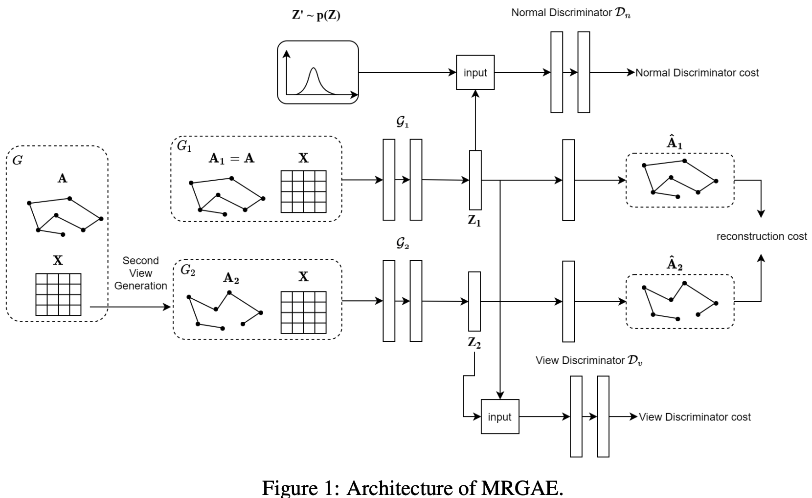

# Multiview Adversarially Regularized Graph Autoencoder (MRGAE)

This repository contains code and resources for the paper **"[Exploiting Node Content for Multiview Graph Convolutional Network and Adversarial Regularization](https://aclanthology.org/2020.coling-main.47/)"**.




## Overview

Network representation learning (NRL) is crucial in the area of graph learning. Recently, graph autoencoders and their variants have gained popularity among node embedding approaches. However, most existing graph autoencoder-based methods focus on minimizing reconstruction errors of the input network and do not explicitly consider the semantic relatedness between nodes.

In this paper, we propose a novel network embedding method that models consistency across different views of networks. More specifically, we create a second view from the input network that captures the relation between nodes based on node content, and we enforce the latent representations from the two views to be consistent by incorporating a multiview adversarial regularization module.

## Key Contributions

- **Multiview Graph Convolutional Network**: We treat the topological structure as the primary view of the network and create a second view based on node content, capturing the semantic relatedness between nodes.
- **Adversarial Regularization**: To preserve the distribution consistency across the two views, we incorporate a multiview adversarial regularization module, shaping the output representations to match an arbitrary prior distribution.
- **Multiview Reconstruction Loss**: Unlike DBGAN (Zheng et al., 2020), which reconstructs node features directly, our method focuses on preserving the semantic relatedness between nodes, leveraging a multiview reconstruction loss function to jointly optimize the model.

## Applications

Our method is evaluated on three diverse tasks:
1. **Link Prediction**
2. **Node Clustering**
3. **30-day Unplanned ICU Readmission Prediction**

Experimental results on benchmark datasets demonstrate that MRGAE outperforms state-of-the-art algorithms in link prediction and node clustering tasks. Furthermore, in the real-world application of ICU readmission prediction, our method achieves promising results compared with several baseline methods.


## Link Prediction
```
python GCN.py
```

## Citation

If you find this resource useful, please consider citing our work:

```bibtex
@inproceedings{lu2020exploiting,
  title={Exploiting node content for multiview graph convolutional network and adversarial regularization},
  author={Lu, Qiuhao and De Silva, Nisansa and Dou, Dejing and Nguyen, Thien Huu and Sen, Prithviraj and Reinwald, Berthold and Li, Yunyao},
  booktitle={Proceedings of the 28th international conference on computational linguistics},
  pages={545--555},
  year={2020}
}
```


